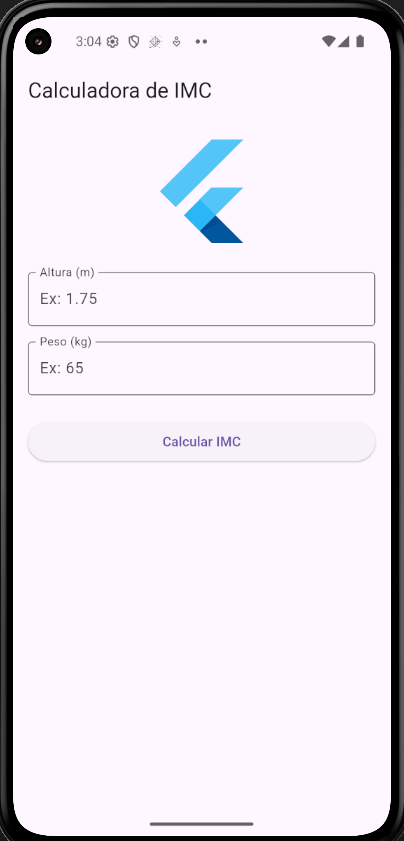
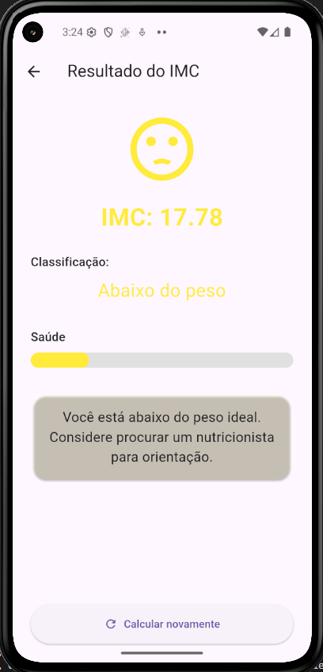
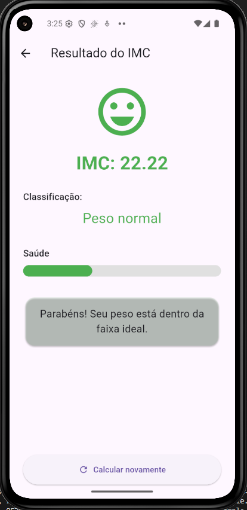
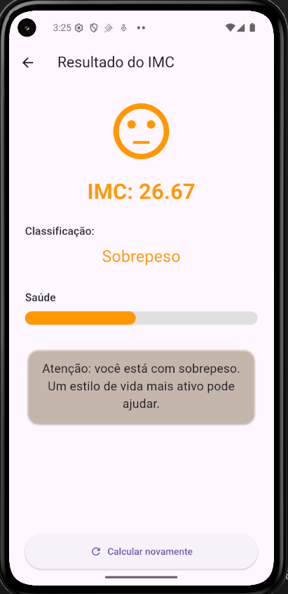
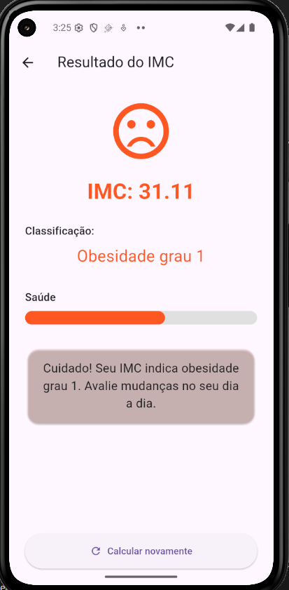
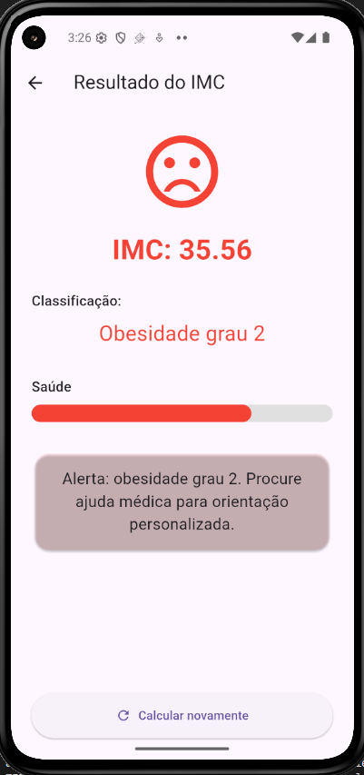
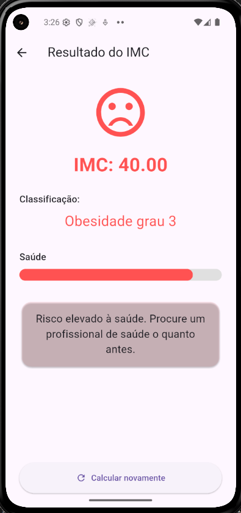

# Calculadora de IMC

Um aplicativo Flutter para cálculo do Índice de Massa Corporal (IMC) com classificação automática.

## Matrícula dos Componentes da Dupla
- Eduardo Martins Cardoso
- Breno Tonini Costa

## Capturas de Tela do Aplicativo

| Tela Inicial | Resultado - Abaixo do Peso | Resultado - Normal |
|--------------|----------------------------|--------------------|
|  |  |  |

| Resultado - Sobrepeso | Resultado - Obesidade Grau 1 | Resultado - Obesidade Grau 2 |
|-----------------------|------------------------------|------------------------------|
|  |  |  |

| Resultado - Obesidade Grau 3 |
|------------------------------|
|  |

## Recursos
- Campos para inserção de altura (metros) e peso (kg)
- Cálculo automático do IMC ao pressionar o botão
- Classificação do resultado (Abaixo do peso, Normal, Sobrepeso, etc.)

## Tecnologias Utilizadas
- Flutter (Framework de UI)
- Dart (Linguagem de Programação)
- Material Design (Interface Moderna)

## Como Usar
- Insira sua altura em metros (ex: 1.75)
- Insira seu peso em quilogramas (ex: 65)
- Clique no botão "Calcular IMC"
- Veja seu resultado e classificação

## Contribuição

Projeto acadêmico não aberto para contribuições externas. No entanto, sinta-se à vontade para clonar o repositório e realizar modificações para aprendizado pessoal.

---

Desenvolvido como parte da disciplina **Aplicativos Mobile - Faculdade UCL**.
